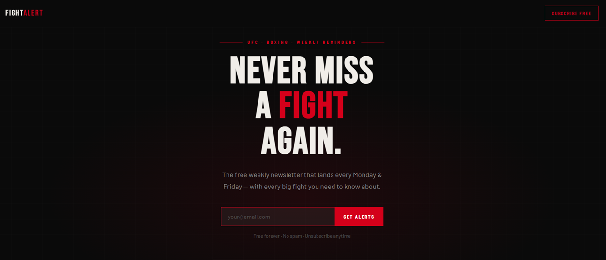

# 🥊 FightAlerts

A modern, responsive landing page for a UFC and Boxing newsletter built with **HTML**, **CSS**, and **JavaScript**.

The goal of this project was to design a clean, high-converting landing page where combat sports fans can subscribe to receive weekly email reminders about upcoming UFC and boxing events.

---

## 🌐 Live Demo

**Website:**
https://tqmouad.github.io/fight-alerts/

---

## 📖 Overview

FightAlerts is a front-end web project focused on creating a professional landing page with a modern user interface and a strong user experience.

The page includes a responsive design, newsletter subscription form, event preview sections, and clear call-to-action components. The project was developed as part of my web development learning journey and demonstrates my ability to build complete, responsive websites using core web technologies.

---

## ✨ Features

* Responsive design for desktop, tablet, and mobile devices
* Modern dark-themed user interface
* Newsletter subscription section
* Call-to-action components
* Fight schedule preview
* Responsive navigation bar
* Smooth scrolling
* Clean typography using Google Fonts
* Pure HTML, CSS, and JavaScript (no frameworks)

---

## 🛠️ Technologies Used

* HTML5
* CSS3
* JavaScript (Vanilla)
* Google Fonts

---

## 📂 Project Structure

```text
fight-alerts/
│
├── index.html
└── README.md
```

---

## 🎯 What I Learned

While building this project, I practiced and improved my skills in:

* Semantic HTML
* Responsive Web Design
* CSS Flexbox
* CSS Grid
* UI Layout Design
* User Experience (UX)
* JavaScript DOM Manipulation
* Form Design
* Landing Page Design
* Project Organization

---

## 🚀 Future Improvements

Some features I would like to add in the future:

* Backend integration for newsletter subscriptions
* Database support
* User authentication
* Fight search functionality
* Multi-language support
* Dark/Light mode switch
* Admin dashboard

---

## 📸 Preview

*A project screenshot will be added here.*

```markdown

```

---

## 👨‍💻 Author

**Mouad Toufiq**

* GitHub: https://github.com/tqmouad
* Portfolio: Coming Soon

---

## 📄 License

This project was created for educational and portfolio purposes.
